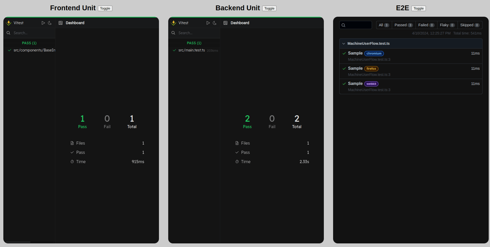

# The Superawesome Frontend Boilerplate


My Vue frontend starter with tests, CI/CD, backend - everything dockerized, don't even need nodejs locally! Also with a [styleguide](./frontend/) for large-scale frontend based on my experience

The only requirements are [docker](https://www.docker.com/) and [taskfile](https://taskfile.dev/).

## How to use
If you launch for the first time:
```
cd .dev
task env
task init
task up
```

If not:
```
cd .dev
task up
```

And that's all!

You now have backend, tests, CI/CD, and other fancy buzzwords but nothing is installed on your machine locally. You are gorgeous!

Go to [localhost](http://localhost) and hooray!

## Stack

Frontend: [vue 3](https://vuejs.org/), [typescript](https://www.typescriptlang.org/), [xstate](https://stately.ai/), [tailwind](https://tailwindcss.com/), [vite-ssg](https://github.com/antfu/vite-ssg).

Backend: [nodejs](https://nodejs.org/), [express](https://expressjs.com/).

Test: [vitest](https://vitest.dev/) for unit, [playwright](https://playwright.dev/) for e2e.

Lint: [eslint](https://eslint.org/) with [custom config](./eslint.config.js) (based on [antfu/eslint-config](https://github.com/antfu/eslint-config)) + [stylelint](https://stylelint.io/) with [custom config](./stylelint.config.js).

## Features
- [Styleguide for large-scale frontend based on my experience](./frontend/).

- [Live tests management panel](http://localhost/tests/).

  It's just something to place it on another monitor and immediately know if something breaks.

  

- [Ready to CI/CD to Github Actions](./.github/workflows/).

  Test and build on `pull request` to `master`, deploy on `push` to `master`.

- [Xstate](https://stately.ai/).

  I am such a huge fan of it, I use it in every project. See an example of a login machine [here](./frontend/src/components/FormLogin/machines/).

  Also check how XState can own e2e-testing [here](./frontend/e2e/).

  Invest your time into learning it, it's an absolute life changer.

## Known issues:
- If you are not on Linux, you need to go to [Taskfile.yaml](./.dev/Taskfile.yaml) and search for `TODO`.

  You will need to add some tweaks to the configuration.

- When you visit [live tests management panel](http://localhost/tests/) for the first time there will be no e2e tests.

  You need to manually run `task test:e2e` (or `task test:e2e:ui`), then `task restart`.
